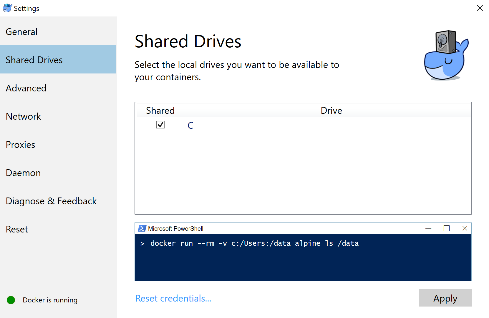
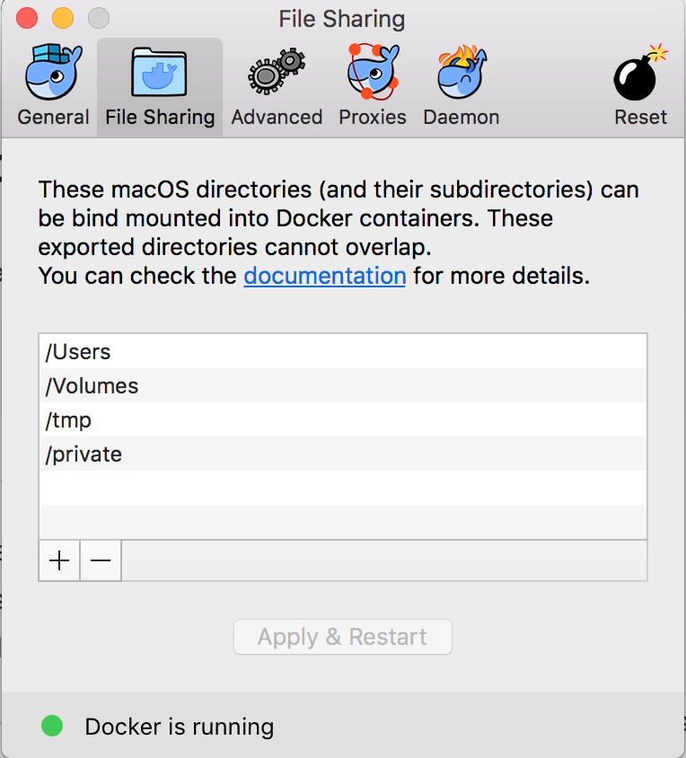

# Docker 101 Workshop - The Basics

- [Getting started](#getting-started)
	- [Windows 10 Pro](#windows-10-pro)
	- [OSX](#osx)
	- [Any Linux distro](#any-linux-distro)
	- [Any other operating system](#any-other-operating-system)
	- [Verify install](#verify-install)
- [Running your first container](#running-your-first-container)
	- [Pulling images](#pulling-images)
	- [Starting a container](#starting-a-container)
	- [Running something more interesting](#running-something-more-interesting)
	- [Running detached containers](#running-detached-containers)
	- [Stopping, restarting and removing containers](#stopping-restarting-and-removing-containers)
	- [Passing environment variables](#passing-environment-variables)
	- [Removing images](#removing-images)
	- [Getting help with commands](#getting-help-with-commands)
- [Creating images](#creating-images)
	- [Committing a container](#committing-a-container)
	- [Creating a simple image using a Dockerfile](#creating-a-simple-image-using-a-dockerfile)
	- [Creating an Angular Docker image](#creating-an-angular-docker-image)
	- [Reducing the image size](#reducing-the-image-size)
- [Volumes](#volumes)
	- [Attaching a volume to a single container](#attaching-a-volume-to-a-single-container)
	- [Using containers as volumes](#using-containers-as-volumes)
- [Analysing containers](#analysing-containers)
- [Docker 102 Workshop](#docker-102-workshop)
- [Further reading](#further-reading)
	
# Getting started

In this section, we will set up an environment so that we can get
started using Docker.

Docker depends on Linux Containers and therefore only runs natively on
Linux distributions. There are solutions for both Windows and OS X,
which usually run a small Linux distribution in the background on which
Docker is installed.

### Windows 10 Pro

To use Docker with Windows 10 you will need the Pro edition, because
Docker uses Hyper-V virtualization to create a virtual machine which
runs Linux. If you use another version of Windows, go to section
\[OtherInstall\]. Before installing Docker make sure you have already
installed Hyper-V on your machine (Note: if you also have VirtualBox,
make sure it isn’t running, because they can not run at the same time).

To install Docker follow the steps at
<https://store.docker.com/editions/community/docker-ce-desktop-windows>.
After that, open the Docker settings and go to the `shared` tab. Make sure the
correct drives are shared (Note: a prompt might appear to enter your
Windows password). if you like, you can give the Docker machine more
CPU’s and memory at the tab `advanced`.

### OSX

To install Docker follow the steps at
<https://store.docker.com/editions/community/docker-ce-desktop-mac>.
After that open the Docker preferences and go to the `File Sharing` tab. Make sure the
workshop directory can be reached.

### Any Linux distro

The installation depends on which Linux distribution you use. See
<https://www.docker.com/community-edition#/download> for more
information, or check the website of the distribution you use.

### Any other operating system

For the people using any other operating system, we have prepared a
Virtual Box image with Docker already installed. It runs Docker in a
virtual Ubuntu Linux environment. To get started, make sure that you
have VirtualBox installed. This workshop has been tested with version
5.1.22 of VirtualBox. You can find the install VirtualBox from here
<https://www.virtualbox.org/wiki/Downloads>.

Download the VirtualBox image (.ova file) from
<https://drive.google.com/file/d/0B0OENjIQS4O4U0lRdGZlNU4xUjQ>. You can
import the image either from VirtualBox itself (File, Import
Appliance...) or by double clicking on the image file. That should
create the virtual machine for you.

Once the image is imported, you can start the virtual machine. Use the
following credentials to log in:

    Username: dockerworkshop
    Password: dockerworkshop
    

### Verify install

After installing Docker, check if it has been installed correctly by
typing the following command:

    docker version
    

This should display the current version of Docker you are running.

# Running your first container

This workshop will focus on using Docker through the command line. So
fire up your favourite terminal or command prompt.

### Pulling images

When you want to run a Docker container, you instantiate one based on a
specific *image*. An image is nothing more than a certain saved machine
state, i.e. a machine running with a specific underlying OS and a set of
installed applications, and any other files and folders that have been
saved in it.

To pull an image, you can use the following command:

    docker pull [OPTIONS] NAME[:TAG|@DIGEST]
        

The parts between the brackets are optional. The only required argument
is the `NAME`, which is the name of the image as specified in the Docker
registry you are pulling from. By default Docker pulls the images from
the Docker Hub registry <https://hub.docker.com/>, but you can also set
up your own registry. At the Docker Hub you can find many images with
software already installed, for example MySQL, saving you the trouble of
installing and configuring it yourself.

An image can have different versions, and you can pull such a version
with the `TAG` argument. Docker will then pull in the latest version
which is specified under that specific tag. You can be even more
specific by using the `@DIGEST` argument, which is a reference to a
specific build of an image. If no tag or digest is provided, Docker will
pull in the image version tagged as `latest`, for example `alpine:latest`.

Let’s pull an image containing an Alpine Linux installation. To do that,
type in the following command:

    docker pull alpine
        

Running the above command will give you a certain output, which looks
similar to

    Using default tag: latest
    latest: Pulling from library/alpine
    88286f41530e: Pull complete
    Digest: sha256:1072e499f3f655a032e88542330cf75b02e7bdf673278f701d7ba61629ee3ebe
    Status: Downloaded newer image for alpine:latest
        

Now, a number of things happened here. Because no tag was specified,
Docker pulled the Alpine image tagged as `latest`. After that, several
layers were downloaded, all of which are necessary for this particular
image. These layers are identified by a hash, like `88286f41530e` in the
above example. A layer is a snapshot of an image, similar to the way Git
stores commits. They will be explained further when we start building
our own images.

After stating the different layers, Docker shows the digest of this
particular Alpine image. If we want to pull this very specific image
later on, we can use this digest as specification, because the `latest`
tag could point to a different image in the future. It isn’t really
recommended to use a digest, you should try to use specific tags such as
`alpine:3.5`.

You can get an overview of all the images on your local system by using
the following command:

    docker images
        

This commands displays a couple of columns with information about the
name, tag, ID, creation date and size of each image. This will look
similar to this:

    REPOSITORY   TAG      IMAGE ID       CREATED       SIZE
    alpine       latest   7328f6f8b418   2 days ago    3.97 MB
        

As you can see, the Alpine image is really small. For comparison,
ubuntu:latest is 119 MB. That’s why Alpine is used for a lot of Docker
images, and it is also the reason we use it in this workshop.

### Starting a container

Now that we have an image, we can start running containers.

When creating a container, you use an image as its base state. So you
run an instance of the image. You can simultaneously run several
containers based on the same image, so you could have multiple instances
running of your application. The changes you make in a container do not
reflect back on the image it was created from. For instance, if you
would create an Alpine container from the image, and you give it a
command to create a file, a new container made from the same image would
not contain the newly created file.

We are going to use our Alpine image to execute a simple command. In the
terminal, type the following:

    docker run alpine echo "Hello World!"
        

This will, rather unsurprisingly, give the following output:

    Hello World!
        

We just instructed Docker to `run` a command in a **new** container
based on the `alpine` image we have. Furthermore, we specified the
command to run: `echo` the string “Hello World!”.

A container runs only as long as is required to execute its command.
After the echo statement in the previous example was finished, the
container stopped and is no longer running.

### Running something more interesting

The above exercise showed the very basics of running a container, but
its use was not very interesting. Time for something a bit more
practical. Docker containers are used to run any sort of software, be it
an application server, database, reverse proxy, or whatever other type
of software you can think of. For the next exercise, we are going to run
an nginx http server.

Even though we do not yet have an image with nginx available, run the
following command to start a container based on the nginx:alpine image:

    docker run -i -t -p 8080:80 nginx:alpine
        

Because we did not yet download this image, you’ll see the following
output:

    Unable to find image 'nginx:alpine' locally
    alpine: Pulling from library/nginx
    019300c8a437: Pull complete
    0cfc066c1b2b: Pull complete
    9620806a6795: Pull complete
    720bc580668c: Pull complete
    Digest: sha256:13231e43f4e28866a418609a53dd7aee03442a4f8c9bdbacd5b7864a8fc52444
    Status: Downloaded newer image for nginx:alpine
        

Since Docker could not find the image locally, it searched for and found
it in the Docker Registry automatically. After that, the output shows
Docker pulling in the various layers that make up this image and, after
that, the nginx server is started within the container (this generates
no output). The `-p 8080:80` argument binds port 80 of the container on
port 8080 on your localhost. If we don’t use a `-p` argument, we
wouldn’t be able to reach the server. Now, however, we can visit the
nginx welcoming page by going to <http://localhost:8080>. To make sure
the container stops when we use `Ctrl+C`, we needed to use the `-i`
argument to make sure it is interactive, and `-t` to create a
pseudo-TTY. These two arguments are often combined as `-it`.

Note how, in this case, we did not specify a command for the container.
Because of this, Docker executes the default command that was given when
the nginx:alpine image was built, but more on that later. To stop the
server and the container it is running in, simply use `Ctrl+C` to cancel
execution.

### Running detached containers

In the previous two exercises containers were run in such a way that you
could see the output of their processes. Another way to run a container
is in *detached* mode, which can be done by adding the argument `-d`.
When using this argument, Docker will start the container in the
background and return control to the terminal. Try starting an
nginx:alpine container with the following command:

    docker run -d -p 8080:80 nginx:alpine
        

The output of this command will look something like this:

    019fd4cb7a72993f5306d3b7601e5817bf8e6e0c4140a4240c1aa4999e1bec49
        

The output hash is a unique identifier for the container you just
started. Now, instead of seeing the output of the server starting up,
control is returned to your local terminal. You can verify that the
container is running, though, by going to <http://localhost:8080>, which
should display the same welcoming page you saw before.

To see that there is actually a container running use the following
command:

    docker ps
        

This lists all containers that are currently running and displays some
information about them. The `CONTAINER ID` column contains the first few
characters of the containers’ unique ID, the `IMAGE` column the image on
which the container is based and the `COMMAND` column the command that
is being executed. It also displays when it was created, the current
status (in this case, it has been running for a certain amount of time)
and any ports that have been forwarded to the host system. The last
column, `NAMES`, shows the name of the container. This name can be
specified manually with the `--name <container-name>` argument, e.g.

    docker run -d -p 8080:80 --name mynginxserver nginx:alpine
        

If no name is provided manually, Docker makes one up by giving it a
compound of two random words, e.g. `sad_blackwell` or `berserk_ramen`.

### Stopping, restarting and removing containers

The nginx server is still running, as you saw in the previous chapter
using the command `docker ps`. To stop a running container, use the
`stop` command, like this:

    docker stop <CONTAINER ID | NAME>
        

When you run `docker ps` after that, you will notice that the container
you stopped is no longer listed. But that does not mean that the
container is removed from your system.

Now, add an extra argument to the `ps` command:

    docker ps -a
        

The `-a` or `-all` argument tells Docker to list all containers,
including the containers that are stopped. These containers can be
restarted with the following command:

    docker start <CONTAINER ID | NAME>
        

After this, you can check if it is running again by using `docker ps`,
or in this case by going to <http://localhost:8080>.

To permanently remove a container (not the image) you can use the `rm`
command (make sure the container is stopped first):

    docker rm <CONTAINER ID | NAME>
        

This removes a single container. You can also remove all stopped
containers by using the command:

    docker container prune
        

### Passing environment variables

You can also pass in environment variables when starting a container.
This is done using the `-e` argument, like this:

    docker run -it -e MESSAGE="My environment variable" alpine sh
        

This starts an Alpine container and opens the shell (sh), allowing us to
use this shell inside the container.

To verify that the `MESSAGE` variable has been passed, type the
following:

    echo $MESSAGE
        

which should result in the output

    My environment variable
        

While this particular example might not seem very useful, these
environment variables can be retrieved by applications running inside
your container, and can therefore be used to influence application
behaviour in different containers based on the same image. For example,
defining an environment variable `USELOGGING` could be retrieved inside
a specific container to determine if logging for your application should
be enabled. Exit the container shell using the command `exit`.

### Removing images

Images, as listed by the `docker images` command, can be removed in a
way similar to containers. In fact, the command only differs slightly:

    docker rmi <IMAGE ID | IMAGE NAME + TAG>
        

As with containers, the `image` to be removed can be specified either by
its full name including the tag or by an unambiguous part of its ID.

You can also use one of these commands to delete images, containers, and
volumes (more on that later):

    COMMAND                     EXPLANATION
    docker container prune      Removes all stopped containers
    docker volume prune         Removes all unused volumes
    docker image prune -a       Removes all unused images
    docker system prune -a      All of the above, in the same order
        

The `-a` makes sure that all images that are not used by at least one
container is removed. Without the `-a` it would only remove dangling
images. Dangling images are images without a name and tag, that can
happen if you reuse the same name and tag for another image.

If you use a Docker version $<$ 1.13 (1.13 was released on January 19,
2017), you can’t use the prune commands. Instead, you can use this:

    COMMAND                                   EXPLANATION
    docker rm $(docker ps -aq)                Removes all containers
    docker volume rm $(docker volume ls -q)   Removes all volumes 
    docker rmi $(docker images -aq)           Removes all images
        
        

The structure of these commands is not Docker specific, but use
functionality from the shell you are using. The command in the \$(...)
part is evaluated first, so what you are in fact doing is requesting the
hashes of the available Docker containers, volumes and images, and then
using those lists as input for their respective remove commands.

### Getting help with commands

If you want to find out more about all possible Docker commands and
their arguments, you can use the `help` command.

    docker help
        

which will list all possible commands you can use.

To get more information about a specific command, simply use it as an
argument for `help`. For example, to find out more about the `ps`
command and its options, type this:

    docker help ps
        

# Creating images

In the previous chapter, we went through the very basic commands to get
started using Docker. All of the images we used there were pulled in
from a central repository, the Docker Hub (<https://hub.docker.com/>).
While the Hub may have an enormous amount of available images,
eventually you’ll want to create your own. There are a couple of ways to
achieve this, of which we will discuss two options here. The first one
is committing a container you modified yourself as an image. The second,
generally preferred, option is the automatic creation of images using
Dockerfiles.

### Committing a container

As mentioned before, changes made to a container are not reflected back
on the image it was created from and will, therefore, be lost with the
container itself. It is, however, possible to commit changes made to a
container in the form of a new image. In this exercise, we will make a
small change to a running Alpine container and commit that as our own
image. To get started, start an Alpine container with an interactive
terminal and specify `sh` as the command that has to be executed:

    docker run -it alpine sh
        

This will open a shell inside the container with which we can interact.

Now, we are going to make a (very) minor alteration to the standard
Alpine container by leaving our mark.

    echo "I was here" > proof.txt
        

To check if the above command executed successfully, type the following:

    cat proof.txt
        

This should print the `I was here` message. Now exit the container by
typing `exit`.

As explained before, if we were to start up a new container using the
Alpine image, the proof.txt file wouldn’t be there. To create an image
that does contain our file, we need to create an image using the
`commit` command. To do that, first look up the ID of the container
using `docker ps -a` (when we exited the container, it was stopped, so
we need the `-a` argument here). To create the new image, use the
following command:

    docker commit <container> my-custom-alpine
        

Upon entering this command, Docker will create an image from the
specified container and print its new unique ID as output. Verify its
existence by using the command to list all images. If everything went
correctly, it should now also list a `my-custom-alpine` image. Because
we did not specify a tag it was created with the `latest` tag as a
default.

Now let’s run this freshly created image. Start a container from the new
image, and output the contents of the file. Or if you want, you could
start the container using an interactive shell to view that the file is
there.

    docker run my-custom-alpine cat proof.txt
        

If this prints out `I was here` it means you have successfully created
your own image! Please note that this is a really terrible way to create
an image. Using a Dockerfile is much more efficient, and you can easily
keep track of your changes. Creating an image using the `commit` command
is mostly just useful when debugging or prototyping.

### Creating a simple image using a Dockerfile

While the above method works, it can be quite time-consuming to manually
modify containers and save them as images. And with a Dockerfile you can
create much smaller images if you do it correctly. Therefore, the
preferred way or creating new Docker image is through the use of a
Dockerfile. This file describe all steps that are necessary to create a
specific image.

Now let’s create the same image we made with `commit` using a
Dockerfile. On your machine, create a file with the name `Dockerfile`, with no file
extension. Make sure it is in an empty directory. In the same directory,
create the proof.txt with the text `I was here`. Now open the Dockerfile
in your favorite editor (unless it is emacs ;) ), and write the
following:

    FROM alpine
    LABEL maintainer="replace this with your name or email"
    COPY ./proof.txt /proof.txt
        

We used a couple of instructions here to describe a new Docker image.
The first instruction, `FROM`, is used to declare the image we want to
use as our base. You always need a base image, as minimal as it may be.
In this case, we are building on top of the `latest` version of the
`alpine` image (remember that Docker uses `latest` automatically if not
specified). The second instruction, `LABEL`, is an optional instruction
which can add metadata to your image. In this case we only added one
key-value pair, but you can add as many as you like. 
`Note: Docker also has the MAINTAINER instruction, but it is deprecated`
The last instruction, `COPY`, simply copies the file (COPY src dest). You could
also use `ADD` to copy the file, but add can do much more. If you `ADD`
an archive, it automatically unpacks it, while `COPY` doesn’t. It also
allows you to use a url as the source.

To actually build the image, open your terminal, go to the directory
containing your Dockerfile and run the following command:

    docker build -t my-first-dockerfile .
        

You should see an output like this:

    Sending build context to Docker daemon  3.072kB
    Step 1/3 : FROM alpine
    ---> 7328f6f8b418
    Step 2/3 : LABEL maintainer "your name or email"
    ---> Running in 6f8d453b244e
    ---> ffe36d15abb0
    Removing intermediate container 6f8d453b244e
    Step 3/3 : COPY ./proof.txt /proof.txt
    ---> 579e521c3f10
    Removing intermediate container 3d0de735f6ff
    Successfully built 579e521c3f10
    Successfully tagged my-first-dockerfile:latest
        

The first thing we see is ’Sending build context to Docker daemon
3.072kB’. What Docker does is copying the entire directory of the
Dockerfile to the Docker daemon. Which is only 3.072kB now, but if you
have a huge directory it can take a long while. If you do have a huge
directory, but don’t need everything for your build, you can create a `.dockerignore`
file, which works similarly to a .gitignore file. Then you see three
steps that are executed, with their output (if they have any). Each step
has its own unique hash, which refers to a cached layer (a set of
filesystem changes) of a docker image. So if you run the exact same
instruction again, it will use the cached layer instead of executing it
again. Run the build command again and you will see this:

    Sending build context to Docker daemon  3.072kB
    Step 1/3 : FROM alpine
    ---> 7328f6f8b418
    Step 2/3 : LABEL maintainer "your name or email"
    ---> Using cache
    ---> ffe36d15abb0
    Step 3/3 : COPY ./proof.txt /proof.txt
    ---> Using cache
    ---> 579e521c3f10
    Successfully built 579e521c3f10
    Successfully tagged my-first-dockerfile:latest
        

As you can see, it now uses the cache for both steps.

Now let’s test our custom image:

    docker run my-first-dockerfile cat proof.txt
        

It should output the contents of the file. Remember that you can view
all your local images by running the `images` command.

### Creating an Angular Docker image

Now we will do a bit more than just copy a file. We already created an
app with the Angular CLI for you, using the command `ng new app`. Now we need to
create a Dockerfile that will first install all dependencies, then run
the Angular application. Create the Dockerfile in the angular-app
directory, with the following contents:

    FROM     node:alpine
    WORKDIR  /opt/app
    COPY     app/ .
    RUN      npm install
    EXPOSE   4200
    CMD      ["npm","start"]
        

The first instruction should be familiar now, as we create an image
using `node:alpine` as a base. After that, we specify the working
directory inside the to-be-created image with `WORKDIR`. This is the
directory that will be used as the starting point for subsequent
commands such as `COPY`, `RUN` or `CMD`. The `COPY` copies the contents
of the angular-app to the current directory in the image, which is
/opt/app as we specified it as our `WORKDIR`. Furthermore, `RUN`
specifies a command that is to be executed when *building the image*.
Important to note is that the commands specified with `RUN` are always
run as the root user by default. There is a `USER` instruction available
as well which lets you switch the user with which commands are run. In
this particular example, we want NodeJS to install all the dependencies
for the application, but as this happens during the building of the
image it won’t have to be repeated every time a container is started.
That means that all the dependencies are available and ready when a
container is started. The `EXPOSE` instruction informs Docker that the
container listens on the specified network port at runtime. The app will
run on port 4200, which is why we expose it. You still need to provide
the `-p` option if you want to access it. Finally, we specify the
default command for the container in case none is given in the
`docker run` command. This command is also executed in the working
directory, which is /opt/app in our case.

Next, build the image (this may take a while), and run it without giving
it a command. Remember to use the option -it if you want to be able to
use `Ctrl+C` to stop the container. If you don’t, remember to stop the
container later using `docker stop <container-name>`.

    docker run -p 4200:4200 <image-name>
        

Let’s head over to <http://localhost:4200/> to test it, and you should
see the Angular app.

Instead of using the `CMD` instruction, we can also use `ENTRYPOINT`.

    ENTRYPOINT  ["npm","start"]
        

This allows you to send extra arguments to the entrypoint instruction by
passing it to your `docker run` command:

        docker run -it -p 4200:4200 <image-name> my extra args
        

This will now run `npm start my extra args`. Obviously this does nothing, but you can see that
the extra commands are passed. This does introduce a problem though,
when you want to start an interactive shell.

    docker run -it <image-name> sh
        

This doesn’t work now, because `sh` is passed through to the npm
command. You can however open an interactive shell to a running
container:

    docker exec -it <container id or container name> sh
        

### Reducing the image size

When creating Docker images, it is important to try to reduce the image
size. A real good example of why you would want to have small images is
when using containers in your Continuous Integration/Deployment
pipeline, e.g. GitLab. GitLab can use Docker images to build an
application, so it downloads a Docker image for every step in your
pipeline. It’s really easy to create large images without even noticing.
This is because of the layers Docker uses. The less instructions you
have in your Dockerfile, the faster your build, and it will most likely
also be smaller in size. It is also important to remove any unused
files, as these will also be saved in the layer.

If we look at the Angular image we created before, it’s almost 267MB. To
reduce its size, we can clear the npm cache after running npm install:

    FROM     node:alpine
    WORKDIR  /opt/app
    COPY     app/ .
    RUN      npm install && \
             npm cache clean --force
    EXPOSE   4200
    CMD      ["npm","start"]
        

If we build the image now, you can see its size has been reduced to
232MB. In this case it isn’t much, but that is also because we have a
small application. In some cases it can save a lot of space. Also notice
how the two npm commands are combined in one `RUN` instruction. This
reduces the amount of layers that have to be built in the construction
of the image, as each instruction in a Dockerfile requires a layer.

Another example is when using apt-get. For the same reasons as stated
above, it is recommended to run every apt-get install command in one
`RUN` instruction as opposed to adding a `RUN` instruction for every
package you want to install. And of course clean the apt-get list:

    RUN apt-get update && apt-get install -y \
        aufs-tools \
        automake \
        build-essential \
        curl \
        dpkg-sig \
        libcap-dev \
        libsqlite3-dev \
        mercurial \
        reprepro \
        ruby1.9.1 \
        ruby1.9.1-dev \
        s3cmd=1.1.* \
        && rm -rf /var/lib/apt/lists/*
        

The same applies to using instructions like the `COPY` instruction.

    COPY file1 /somedir
    COPY file2 /somedir
        

versus

    COPY file1 file2 /somedir
        

Even though the resulting image will be the same, this way Docker will
require an extra step, and therefore an extra layer, when building. This
can slow down the building process.

This doesn’t mean that you should put everything inside a single
instruction, but you should be aware of what happens when you add an
extra one. Try to keep your Dockerfile maintainable as well, so find a
balance between maintainability and image size.

See
<https://docs.docker.com/engine/userguide/eng-image/dockerfile_best-practices/>
for a list of best practices when creating a Dockerfile.

The instructions we used so far in our Dockerfiles are only a small set
of options you have. You can find more at
<https://docs.docker.com/engine/reference/builder/>.

# Volumes

Docker containers are generally meant to be easily shut down and
replaced. Therefore, they should not contain any data that has to be
persistent. It is generally a bad idea to have data stored inside your
image, because (obviously) the image size will increase. Luckily, there
is a way that allows containers to persist data outside themselves, so
you won’t lose it when shutting down a container. This is done through
the use of *volumes*.

### Attaching a volume to a single container

A volume can simply be a directory on your host system that you mount in
a Docker container. This can be done by using the `-v` argument when
starting a container. Create a new directory and name it `data_dir`. Additionally,
create one or more files in this new folder, for example a text file.
Then, navigate to the parent of this directory in the terminal and type
in the following command:

    docker run -it -v $(pwd)/data_dir:/opt/host_data alpine sh
        

With this command, we bind the `data_dir` directory to the directory
`/opt/host_data` inside the container. The `$(pwd)` command is not
Docker-specific but a terminal command used to retrieve the current
directory we’re in, which has to be the one which has the data\_dir
directory as its subfolder. This is needed because the `-v` option
requires absolute paths. Please note that the `$(pwd)` command will not
work in Windows. In Windows you need to use a full path with backslashes
(forward slashes if you use git-bash):

    docker run -it -v C:\Users\<user>\Documents\data_dir:/opt/host_data alpine sh
        

If you go to that folder in your container and type `ls` you should see
a list of the files you created in the data\_dir folder earlier. The
reverse also works: adding or modifying files inside this directory in
the container will reflect directly on the files of the host system.
Feel free to try it with the following command:

    echo filecontent > filecreatedincontainer.txt
        

You should now see the new file in the directory on your host machine.
You could use this directory to save data you’d want to keep after
stopping the container, or that you want to share between containers.

### Using containers as volumes

When sharing data between containers with volumes, it is generally
better to have a dedicated *Data Volume Container* for that purpose. You
can use any image you like for that. In the next exercise, we are going
to create two containers that will share a directory from a third one.
First, we create the Data Volume Container based on an Alpine image:

    docker create -v /mydata --name datastore alpine
        

The `create` command creates a container without starting it.
Furthermore, we name the container ourselves so that we can conveniently
refer to it later on.

For the next step, let’s start the containers that will use our created
data volume. In two separate terminals, execute the following command:

    docker run -it --volumes-from datastore alpine sh
        

If you use `ls` in these containers, you’ll see the directory `mydata`
amongst them. Anything in this directory will be shared between the
containers that mounted the datastore container as a volume.

To test this, run the following command in one of the containers:

    echo This is from container 1! > /mydata/message.txt
        

Then, in the other container, use `cat /mydata/message.txt` to print the
contents of that file. Stopping these containers and running new ones
with the data\_store volume attached should all result in the same:
everything in mydata is persisted in the datastore container. You can
also use the `--volumes-from` command multiple times to mount volumes
from different containers into one.

In the first exercise we specified the mounting point on our host
directory ourselves by using the syntax `/host_dir:/data_dir`. In the
second exercise, we only wanted a directory called `/mydata` in the
container. Docker created a directory somewhere on your system which it
subsequently bound to the container. This is called an *anonymous
volume*. This directory is not automatically removed when the container
for which it was originally created is. You can instruct Docker to do
this by appending the `-v` argument when removing a container, for
example:

    docker rm -v datastore
        

If you don’t do that, you may end up with *“dangling” volumes*, or
volumes that are no longer referenced by any container. You can also
remove these *“dangling” volumes* using the command:

    docker volume prune
        

You can list all volumes with the `docker volume ls` command. Docker
uses unique hashes as names for anonymous volumes, much like the ID’s
given to images and containers. You can list all dangling volumes by
adding some extra arguments to this command, like this:

    docker volume ls -f dangling=true
        

After that, you can use `docker volume rm <volume-name>` to permanently
delete any volume you want.

# Analysing containers

Docker provides a number of commands to analyse the various aspects of
your containers. Run a few containers to try these commands out. If you
would like to know how much resources each of your running containers is
using, you can see this using the `stats` command:

    docker stats
        

which will show a live stream of the CPU and memory usage of each of
your running containers (you can stop this with `Ctrl+C`).

To view the logging of a specific container, use the following command:

    docker logs <container>
        

Here, you can specify the container using either the full *container
name* as it appears under the `NAMES` column in the `docker ps` command,
or the `CONTAINER ID`. For the latter option, you don’t have to provide
the entire ID, just enough so that it is not ambiguous in your current
situation. For example, if we had two containers running with ID’s
`0xab123...` and `0xac97j...` respectively, the following command would
succeed:

    docker logs 0xab
        

while this would fail:

    docker logs 0xa
        

This command is especially useful if you want to see the logging of
detached containers.

One last command that is worth mentioning is `inspect`, which can be
used as follows:

    docker inspect <container>
        

in which the container can be specified in the same way as with the
`logs` command. This prints quite a bit of low-level information
regarding the container, such as its status, configuration and network
settings. You could, for example, omit the forwarding of ports using
`-p` and simply approach the server using its own IP address found in
the `IPAddress` property.

# Docker 102 Workshop

We also have a Docker 102 Workshop, which will be on the 26th of July.
It will show you how to use Docker multi stage builds, and Docker
Compose. So the final exercise in this workshop, is to sign up for it.
Go to <https://www.jcore.com/event/docker-102-workshop/>.

# Further reading

In this workshop, we covered the very basics of Docker. While this
should be enough to get started, there still is a lot more available.
Docker itself offers various tools, such as Docker Compose and Docker
Swarm, that can help you to easily start a set of containers or manage
clusters. Furthermore, Docker is often well integrated in third party
software such as Kubernetes, GitLab, and OpenShift. Documentation for
the standard Docker engine as well as other tools provided by Docker
itself can be found at <https://docs.docker.com/>.
